<p align="center">
  
</p>

<h1 align="center">Miktam Bible</h1>

<p align="center">
  <strong>Your Offline Bible Study Companion</strong><br/>
  <em>25 translations · AI assistant · Strong's concordance · voice memos — all running 100% offline on your device.</em>
</p>

<p align="center">
  <a href="#features">Features</a> •
  <a href="#screenshots">Screenshots</a> •
  <a href="#supported-translations">Translations</a> •
  <a href="#tech-stack">Tech Stack</a> •
  <a href="#getting-started">Getting Started</a> •
  <a href="#project-structure">Project Structure</a> •
  <a href="#building-for-production">Building</a> •
  <a href="#license">License</a>
</p>

---

## Features

### 📖 Scripture Reading
Browse the complete Bible across **25 translations** in **15+ languages**. Navigate by book, chapter, and verse with a beautiful dark-mode interface. Long-press any verse to highlight, bookmark, copy, or share.

### 🤖 AI Study Assistant (100% Offline)
Ask theological questions, explore historical context, and unpack biblical definitions using a local **GGUF LLM** (SmolLM2) that runs entirely on your device. No internet required — your conversations stay private.

### 🔍 Strong's Concordance
Look up any Greek or Hebrew word by Strong's number. See the original word, transliteration, definition, and every verse where it appears — across your selected translation.

### 🔎 Full-Text Search
Instantly search the entire Bible for any word or phrase. Results are grouped by book with highlighted matches and one-tap navigation to the full chapter.

### 🎙️ Voice Memos
Record voice study notes while reading. Recordings are auto-tagged with the current book, chapter, and verse for easy retrieval later.

### 📅 Reading Calendar
Track your daily reading habit with a visual calendar heatmap. Maintain your reading streak and monitor weekly/monthly progress.

### 🌓 Light & Dark Mode
Seamless support for both light and dark themes, with an elegant dark background (`#0F0F14`) and gold accent (`#C9A55C`) palette designed for comfortable extended reading.

### 🌍 Multilingual Book Names
Book names are displayed in the native language of the selected translation. Reading Genesis in Arabic? The book grid shows الأسماء العربية.

---

## Screenshots

<table>
  <tr>
    <td align="center"><strong>Home</strong></td>
    <td align="center"><strong>Book Grid</strong></td>
    <td align="center"><strong>Scripture Reading</strong></td>
    <td align="center"><strong>Translations</strong></td>
  </tr>
  <tr>
    <td>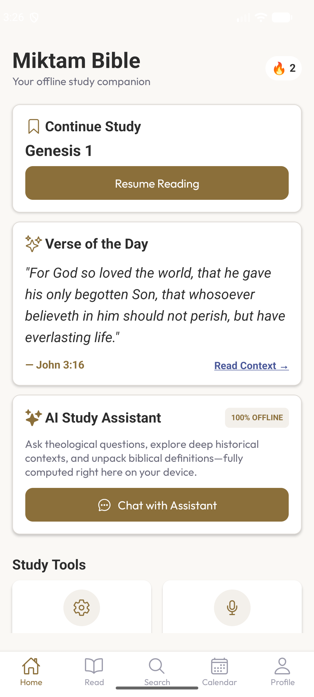</td>
    <td>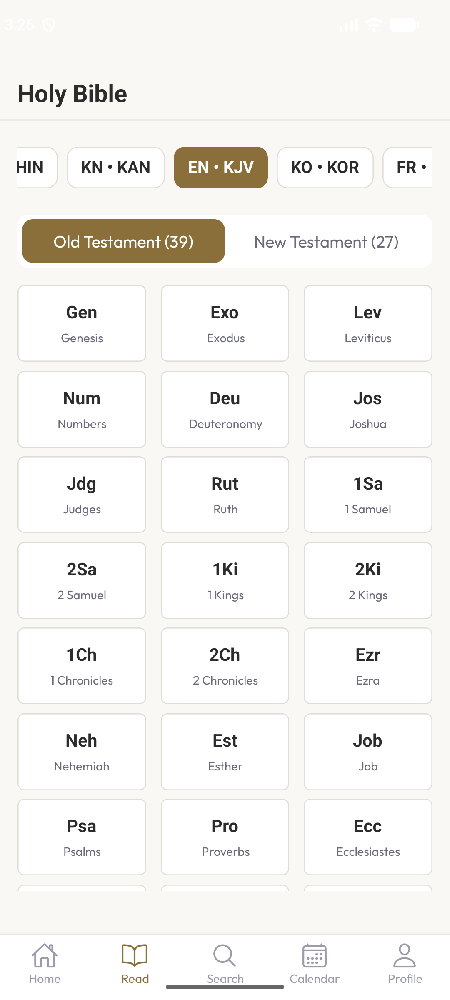</td>
    <td>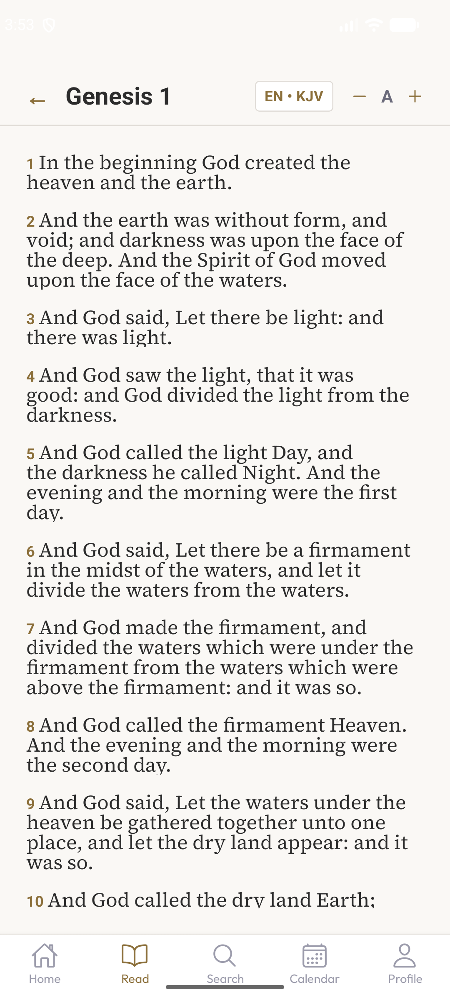</td>
    <td>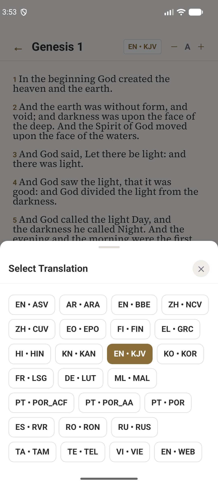</td>
  </tr>
  <tr>
    <td align="center"><strong>Search</strong></td>
    <td align="center"><strong>Verse Actions</strong></td>
    <td align="center"><strong>Calendar</strong></td>
    <td align="center"><strong>Profile</strong></td>
  </tr>
  <tr>
    <td>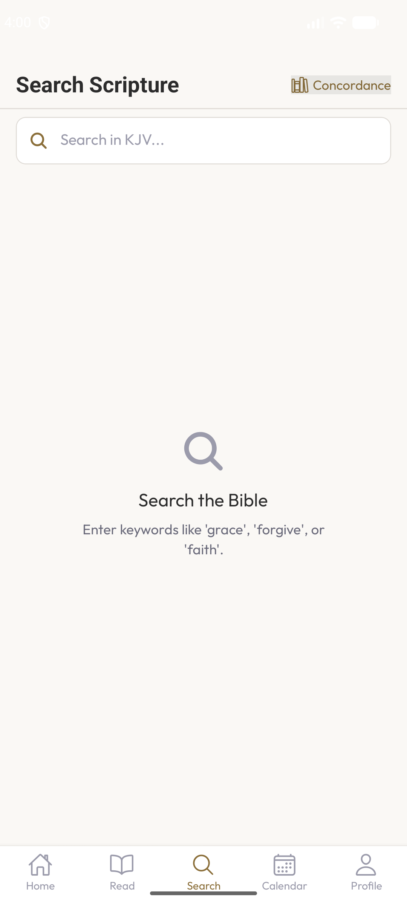</td>
    <td>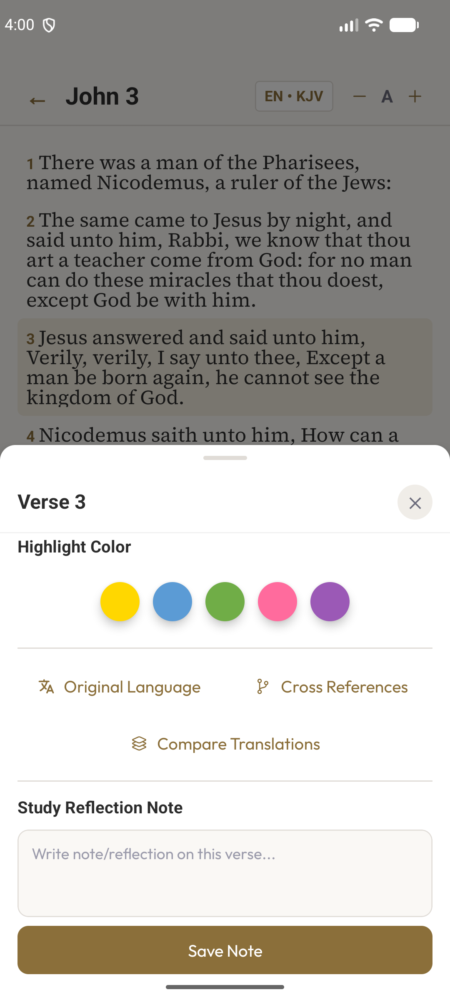</td>
    <td>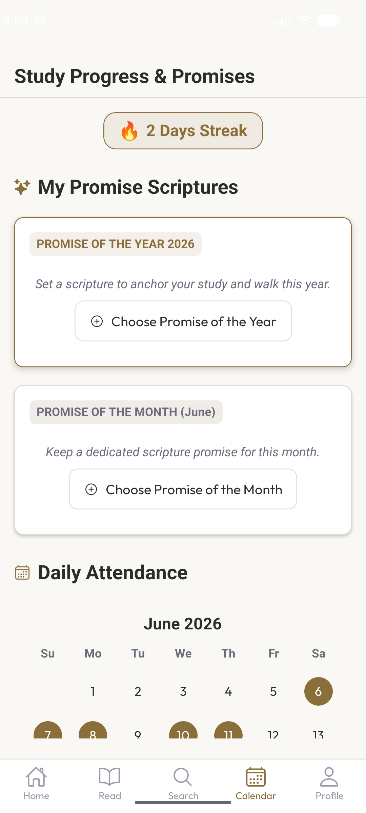</td>
    <td>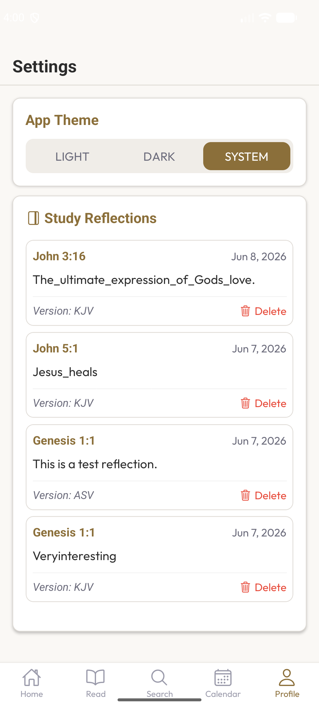</td>
  </tr>
</table>

### Multilingual Support

<table>
  <tr>
    <td align="center"><strong>Arabic</strong></td>
    <td align="center"><strong>Hindi</strong></td>
    <td align="center"><strong>Korean</strong></td>
    <td align="center"><strong>Tamil</strong></td>
  </tr>
  <tr>
    <td>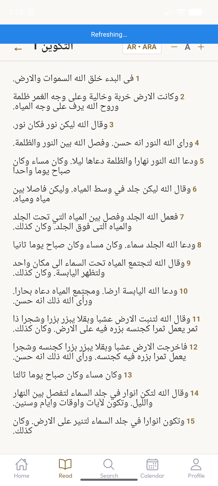</td>
    <td>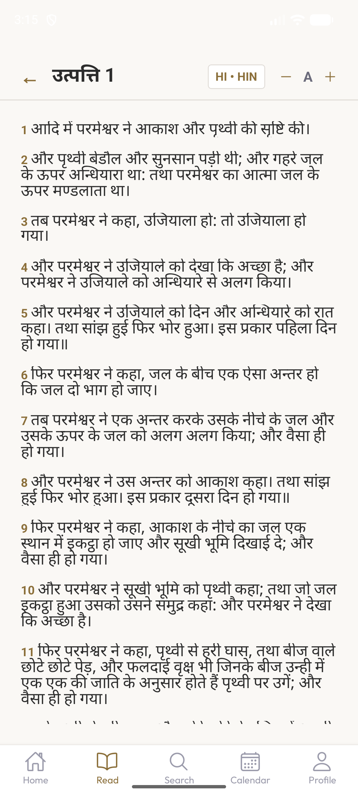</td>
    <td>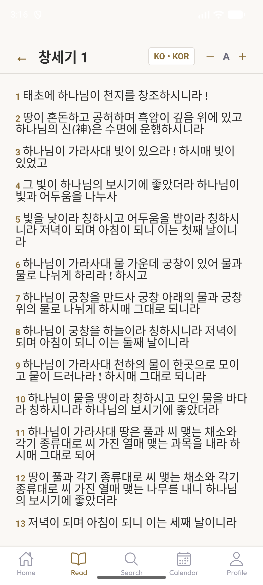</td>
    <td>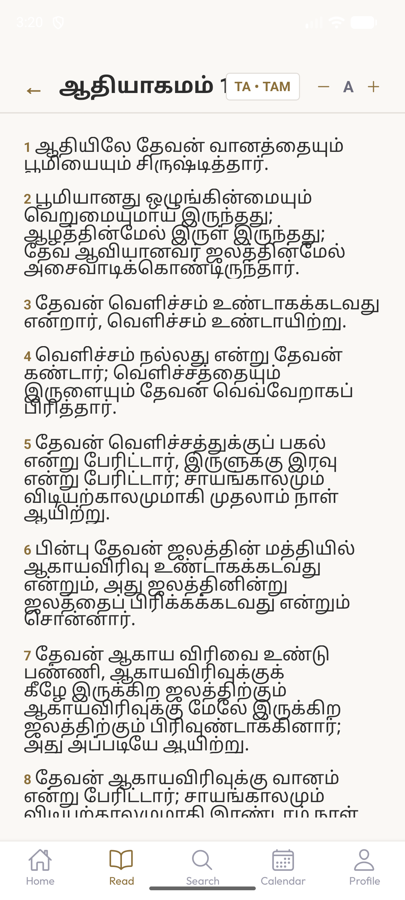</td>
  </tr>
</table>

### Light & Dark Mode

<table>
  <tr>
    <td align="center"><strong>Dark Mode</strong></td>
    <td align="center"><strong>Light Mode</strong></td>
  </tr>
  <tr>
    <td>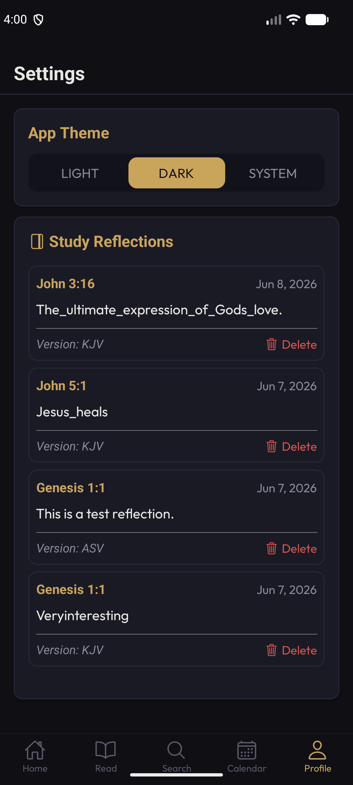</td>
    <td>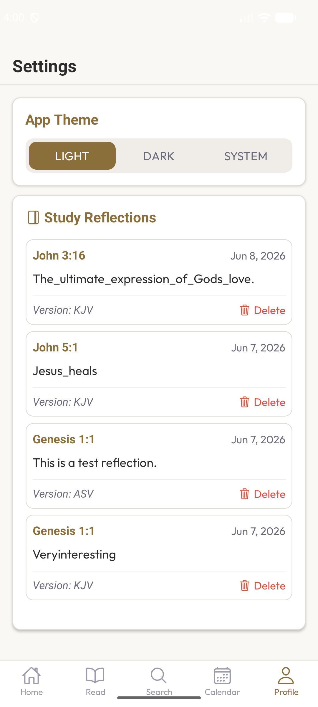</td>
  </tr>
</table>

---

## Supported Translations

| Code | Translation | Language |
|------|------------|----------|
| `kjv` | King James Version | English |
| `asv` | American Standard Version | English |
| `bbe` | Bible in Basic English | English |
| `web` | World English Bible | English |
| `ara` | Arabic Bible | Arabic |
| `ncv` | New Chinese Version | Chinese |
| `cuv` | Chinese Union Version | Chinese |
| `epo` | Esperanto Bible | Esperanto |
| `fin` | Finnish Bible | Finnish |
| `lsg` | Louis Segond | French |
| `lut` | Luther Bible | German |
| `grc` | Greek New Testament | Greek |
| `hin` | Hindi Bible | Hindi |
| `kan` | Kannada Bible | Kannada |
| `kor` | Korean Bible | Korean |
| `mal` | Malayalam Bible | Malayalam |
| `por` | Portuguese Bible | Portuguese |
| `por_acf` | Portuguese ACF | Portuguese |
| `por_aa` | Portuguese Almeida Antiga | Portuguese |
| `ron` | Romanian Bible | Romanian |
| `rus` | Russian Bible | Russian |
| `rvr` | Reina Valera | Spanish |
| `tam` | Tamil Bible | Tamil |
| `tel` | Telugu Bible | Telugu |
| `vie` | Vietnamese Bible | Vietnamese |

---

## Tech Stack

| Layer | Technology |
|-------|-----------|
| **Framework** | [Expo](https://expo.dev) SDK 56 + [React Native](https://reactnative.dev) 0.85 |
| **Router** | [Expo Router](https://docs.expo.dev/router/introduction/) (file-based routing) |
| **Database** | [expo-sqlite](https://docs.expo.dev/versions/v56.0.0/sdk/sqlite/) — preseeded 648 MB offline database |
| **AI Engine** | [llama.rn](https://github.com/nickhobbs/llama.rn) — on-device GGUF inference (SmolLM2 Q4) |
| **Audio** | [expo-audio](https://docs.expo.dev/versions/v56.0.0/sdk/audio/) — voice memo recording |
| **State** | [Zustand](https://zustand-demo.pmnd.rs/) — lightweight global state |
| **Storage** | [react-native-mmkv](https://github.com/mrousavy/react-native-mmkv) — high-performance key-value storage |
| **Animations** | [react-native-reanimated](https://docs.swmansion.com/react-native-reanimated/) |
| **Typography** | [Google Fonts](https://fonts.google.com) — Outfit & Source Serif 4 |
| **Language** | TypeScript 6.0 |

---

## Getting Started

### Prerequisites

- **Node.js** ≥ 18
- **Android Studio** with Android SDK installed
- **Java** — Android Studio's bundled JBR runtime (see below)

### Installation

```bash
# Clone the repository
git clone https://github.com/skalvinnathan/bible.git
cd bible

# Install dependencies
npm install --legacy-peer-deps
```

### Running on Android Emulator

```bash
# Start the Metro bundler
npm run start

# In a separate terminal, run on Android
npm run android
```

### Environment Setup (Windows)

The native Android build requires `JAVA_HOME` to point to Android Studio's bundled JBR:

```powershell
$env:JAVA_HOME = 'C:\Program Files\Android\Android Studio\jbr'
```

Ensure `android/local.properties` has the correct SDK path:

```properties
sdk.dir=C\:\\Users\\<your-username>\\AppData\\Local\\Android\\Sdk
```

---

## Project Structure

```
bible/
├── app/                        # Expo Router screens
│   ├── (tabs)/                 # Bottom tab navigation
│   │   ├── index.tsx           #   Home tab (dashboard, VOTD, streak)
│   │   ├── read/               #   Read tab (book grid → chapters → verses)
│   │   ├── search.tsx          #   Full-text search
│   │   ├── calendar.tsx        #   Reading streak calendar
│   │   └── profile.tsx         #   Settings & profile
│   ├── chat.tsx                # AI study assistant chat
│   ├── bookmarks.tsx           # Highlights & bookmarks
│   ├── recordings.tsx          # Voice memos
│   └── concordance/            # Strong's concordance lookup
│       ├── search.tsx          #   Search by word or number
│       └── [strongsNumber].tsx #   Detailed word view
│
├── src/
│   ├── ai/                     # LLM model management & inference
│   ├── components/             # Reusable UI components
│   │   ├── ui/                 #   Design system (Text, Card, Button, Badge…)
│   │   ├── scripture/          #   Verse display, chapter reader
│   │   ├── chat/               #   Chat bubbles, input, prompts
│   │   ├── calendar/           #   Heatmap calendar
│   │   ├── recorder/           #   Audio record/play controls
│   │   └── shared/             #   Header, EmptyState, etc.
│   ├── database/               # SQLite schema & migrations
│   ├── hooks/                  # Custom React hooks
│   ├── services/               # Business logic (bible, reading progress, recordings)
│   ├── stores/                 # Zustand state stores
│   ├── theme/                  # Color tokens, spacing, typography
│   ├── types/                  # TypeScript type definitions
│   └── utils/                  # Constants, formatters, book translations
│
├── android/                    # Native Android project (Expo prebuild)
│   └── app/
│       └── src/main/assets/    # Preseeded binary assets
│           ├── bible.db        #   SQLite database (~648 MB)
│           └── bible-q4km.gguf #   LLM model (~105 MB)
│
├── assets/                     # App icons, splash screen, fonts
├── app.json                    # Expo configuration
├── package.json                # Dependencies & scripts
└── CLAUDE.md                   # Developer build guide
```

---

## Building for Production

### Android App Bundle (AAB)

```powershell
cd android
$env:JAVA_HOME = 'C:\Program Files\Android\Android Studio\jbr'
.\gradlew.bat bundleRelease
```

The signed AAB will be generated at:
```
android/app/build/outputs/bundle/release/app-release.aab
```

### Android APK

```powershell
cd android
$env:JAVA_HOME = 'C:\Program Files\Android\Android Studio\jbr'
.\gradlew.bat assembleRelease
```

---

## Offline Architecture

Miktam Bible is designed to work **entirely offline** after initial installation:

```
┌─────────────────────────────────────────┐
│              Miktam Bible               │
│                                         │
│  ┌─────────┐  ┌──────────┐  ┌────────┐ │
│  │ Expo    │  │ SQLite   │  │ GGUF   │ │
│  │ Router  │  │ Database │  │ LLM    │ │
│  │         │  │ (648 MB) │  │(105 MB)│ │
│  └────┬────┘  └────┬─────┘  └───┬────┘ │
│       │            │             │      │
│  ┌────▼────────────▼─────────────▼────┐ │
│  │         React Native Runtime       │ │
│  │    (Hermes JS Engine + JSI)        │ │
│  └────────────────────────────────────┘ │
│                                         │
│  📖 25 Translations  🔍 Concordance     │
│  🤖 AI Chat          🎙️ Voice Memos    │
│  📅 Reading Tracker  ⭐ Bookmarks       │
│                                         │
│         No Internet Required            │
└─────────────────────────────────────────┘
```

---

## License

This project is licensed under the **MIT License** — see the [LICENSE](LICENSE) file for details.

---

<p align="center">
  <sub>Built with ❤️ for the glory of God</sub>
</p>
